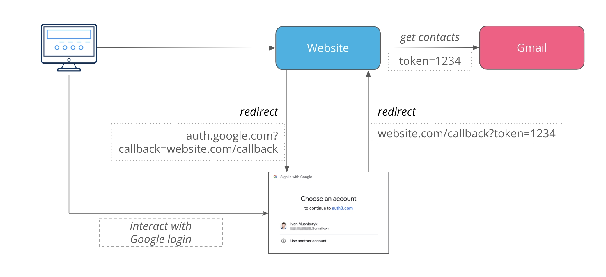
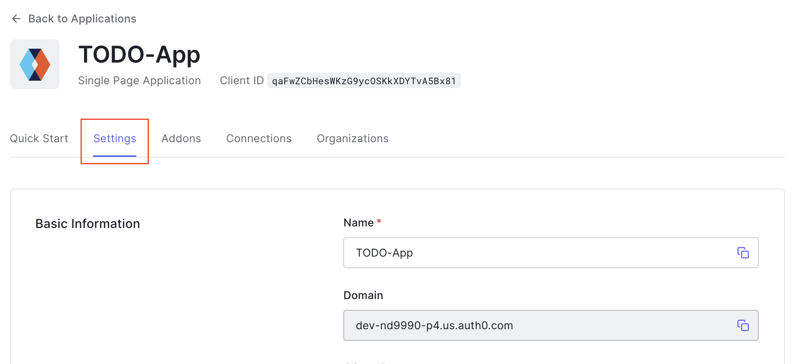

# Key Points
* This is your TODO list application that uses AWS Lambda and Serverless
    * Example of a "serverless" application 
* You can create/remove/update/get TODO items.
* "Serverless" -> **Serverless Framework** - One of the most popular frameworks for creating serverless applications. 
It supports various cloud providers including AWS, Google Cloud, Microsoft Azure, etc. It allows to deploy package 
code, deploy Lambda functions, provision resources, and so on.

## OAuth + Autho0

### OAuth

"OAuth" is basically a means of obtaining a token from a third party service that can be used for authentication

**OAuth Flow**:




### Auth0

"Auth0" is an implementation of the OAuth protocol that is commonly used. (This is like what triggers the redirect
to login w/ Google or whatever)


# Files

## Yes Review

* backend/serverless.yml - Define the serverless app configuration details
    * Run `serverless deploy --stage dev --region us-east-1` to build all your serverless resources

* backend/src/lambda/http/getTodos.js - GetTodos lambda function handler
    * Note that this is what returns the HTTP status code, headers, etc. The structure of this stuff is what makes
    it conform to the HTTP protocol (and I guess sort of REST APIs too)
    * Notice that the business logic (`getTodos()`) lives in another file. Separating the business logic from the 
    "ports & adapters" is what's known as "hexagonal" or "ports and adapters" architecture
        * "Ports & adapters" being the parts of the application that interact w/ outside services. Eg DBs, message 
        queues, etc.
            * Ports - event sources, eg notifications, database, UI, etc
            * Adapters - Glue between ports
        * In our application we extend this even further by splitting out the data layer and the http/auth stuff
        (see lambda/ dir). This makes the business logic agnostic to the technologies used so we don't have vendor
        lock in

* backend/src/dataLayer/todosAccess.mjs - Data layer implementation
* backend/src/businessLogic/todos.mjs - Business logic implementation

*Note the directory structure*


## Note

* backend/ + client/ - So like, the backend and the frontend code are split up obviously

# How did deploying work?

## Backend
1. `npm i` - Install Node. (I guess you need this for the packages)
2. `serverless deploy` - Deploy your servelss backend app

## Frontend
*This runs the client-side on your local computer*

1. Create an Auth0 app



2. `npm i`
3. `npm run start` - Starts a React development server at localhost:3000/


## No frontend

You could use curl commands to interact directly w/ the backend like so:

```
curl --location --request POST 'https://{API-ID}.execute-api.us-east-1.amazonaws.com/dev/todos' \
--header 'Authorization: Bearer {JWT-token}' \
--header 'Content-Type: application/json' \
--data-raw '{
    "name": "Buy bread",
    "dueDate": "2022-12-12"
}'
```
